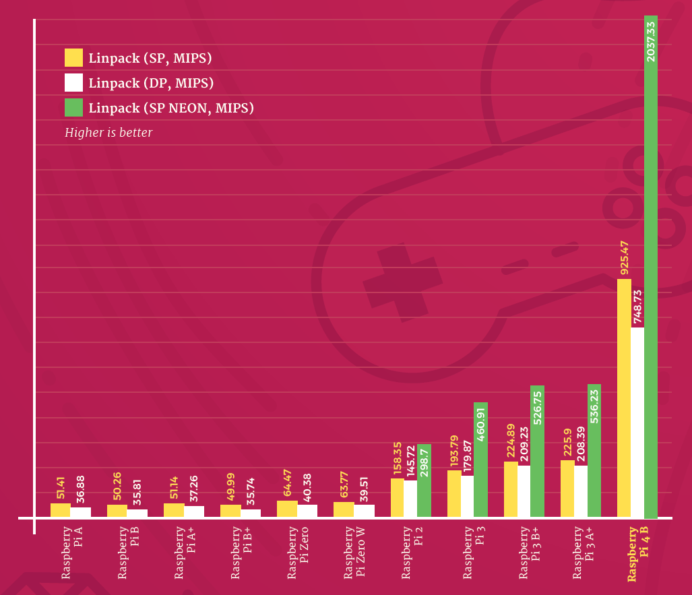

# Hardware

### Overview:

* What coding languages will be used?
* Will we take pictures or videos?
* The creation of a possible miniature version to check the camera angle
* What resolutions are possible with the processing power of the Pi?
* What Raspberry Pi version can handle the needed resolutions?
* Is there a Shield for our needs?
* What case will we use? Water resistance is important due to rain
* How will we handle the cooling of the system?
* What type and size of battery will be needed? We should be able to run for around 12 hours
* Is there a shield that uses SIM Cards
* How will we make sure to sync the internal times of the Pis?

<br>

### Coding Languages:

The coding language is a backbone of this project and one of the most important parts to decide on. Possibilities are:

* Python
* C
* C++
* C# <br>

For the "image recognition" part of the project, python would be one of the best choices due to its vast variety of libraries and frameworks, specifically in image processing and machine learning. The speed of image recognition on the Raspberry Pi will be tested later in the project, but for now, there are a few possibilities to improve it. This could be optimized libraries for the Pi, quantizing models, more efficient models, using hardware accelerators and multithreading. Depending on the cooling options, overclocking might be an option as well. <br>

Overall, Python might be the right choice due to its strong support for OpenCV, machine learning libraries and the Raspberry Pi itself. Python has a large community working on projects, that might also be beneficial for this project.

<br>

### Pictures / Videos:

Additional experiments are required to generate findings in this area.

***note to "Performance"***

<br>

### Possible / Needed Resolutions:

Additional experiments are required to generate findings in this area.

***note to "Performance"***

<br>

### Different Raspberry Pi Versions:

When choosing a Raspberry Pi Version to work with, we need to take a few different values in account. This includes:

* performance
* energy consumption
* price
* availability of shields

<br>

#### Performance

The most important part of the overall performance is the CPU. In the following diagram the CPU performance is better with the newest model of the Pi, but due to product shortages and higher prices, the Pi 3B+ is still an option to keep in mind. The Pi 4B gets the best performance in most aspects such as CPU, GPU, RAM and USB Throughput.



In an image-recognition-experiment conducted by the website arrow.com, it was concluded that there is a 20% performance increase from the Model 3B+ to the Model 4, resulting in a difference of approximately 0.9 seconds in their specific setup. It is important to note that these values may drastically increase by using specialized algorithms and specifications.

<br>

#### Specifications

This table describes the difference between the two models in question. In some tests it shows a huge difference, in the parts most important for this project, they perform almost the same. The size and the layout are the same for both, so most shields can be reused, but cases will need to be changed due to the ethernet port bing moved and the full size HDMI port being replaced by two micro HDMI connectors. <br>
The peak power consumption for the Pi3 is ~5.7 Watts and ~5.6 Watts for the Pi4. <br>


The pricing shows the Raspberry Pi 3B as the overall cheapest model.


| Product                     | Price    |            |
| :---------------------------- | ---------- | ------------ |
| Raspberry Pi 4 Model B 4GB  | 78.99€  | Amazon.com |
| Raspberry Pi 4 Model B 8GB  | 126.04€ | Amazon.com |
| Raspberry Pi 3 Model B 1GB  | 51.21€  | Amazon.com |
| Raspberry Pi 3 Model B+ 1GB | 77.99€  | Amazon.com |

[^1]

<br>

#### Conclusion

Overall can be said that the RaspberryPi3B is the better option for this project, due to a lower price range. While still a great product, the increased performance of the RaspberryPi4, does not justify the higher prices in the case of our specific project.

<br>

### Shields:

There are a few things pre-existing shields would make a lot easier. Luckily enough, the Raspberry Pi community creates a vast variety of shields for almost any purpose. <br>

This are some of the shields that could possibly be used in this project:


| Purpose                                  | Description                                               | Price   | Link                                                                                                                                                                                                                                                 |
| :----------------------------------------- | ----------------------------------------------------------- | --------- | ------------------------------------------------------------------------------------------------------------------------------------------------------------------------------------------------------------------------------------------------------ |
| SIM Card Module                          | EXVIST 4G LTE Industrial Mini PCIe auf USB Adapter USB    | 8.28€  | [Amazon.de](https://www.amazon.de/Industrial-SIM-Kartenslot-geeignet-Anwendungen-Raspberry/dp/B08B7ZRBRZ/ref=sr_1_3?keywords=raspberry%2Bpi%2Bsim%2Bcard&qid=1691175308&s=ce-de&sprefix=raspberry%2Bpi%2Bsim%2Celectronics%2C104&sr=1-3&th=1https:/) |
| Multipurpose Communication with SIM Card | A7670E LTE Cat-1 HAT for Raspberry Pi, Multi Band Support | 38.62€ | [Amazon.de](https://www.amazon.de/Raspberry-Support-Enabling-Communication-Positioning/dp/B097K14K18/ref=sr_1_1?keywords=raspberry%2Bpi%2Bsim%2Bcard&qid=1691175308&s=ce-de&sprefix=raspberry%2Bpi%2Bsim%2Celectronics%2C104&sr=1-1&th=1)            |

There are multiple solutions to choose from, especially for SIM Card readers. These will be important for the overall communication for this project. In case a custom shield is needed, it will be prototyped by hand and after in depth experimentation a more professional version will be created.

<br>

### Housing / Water Resistance:

There are multiple cases pre-made for the Raspberry Pi or just waterproof cases for electrical projects. Here it is important to note that the case not only has to fit the Pi and the basic electronic, but also the battery, which most likely will take a lot of space. <br>

Due to this issue, a separate case for the battery might be an idea to go by.

For the Pi itself a simple box like [this](https://www.amazon.com/-/de/dp/B0B87XSMVP/ref=d_pd_di_sccai_cn_sccl_4_1/138-4383230-3283737?pd_rd_w=1ZrI5&content-id=amzn1.sym.67c5ba31-9419-42ae-aa32-38239ca1805d&pf_rd_p=67c5ba31-9419-42ae-aa32-38239ca1805d&pf_rd_r=ME7FRVRXB2P7WGSEEK14&pd_rd_wg=ELz6d&pd_rd_r=0c6f9d65-af1a-45c0-9712-31c72b109893&pd_rd_i=B0B87XSMVP&th=1https:/) would work perfectly fine, but the issue of heat buildup and cooling will be a problem. The battery might be stored in something like [this](https://www.amazon.de/Knightsbridge-JB55-wetterfeste-Elektrobox-Außenbereich/dp/B08LQZK1Y5/ref=sr_1_7?__mk_de_DE=ÅMÅŽÕÑ&crid=N1TYGXHGGYZA&keywords=outdoor+kasten+wasserdicht&qid=1691176744&sprefix=outdoor+kasteb+wasserdicht%2Caps%2C97&sr=8-7https:/) and wired to the Pi separately. <br>

In case water resistance is less of a priority, a custom 3D printed case will work as well. 

<br>

### Cooling:

Due to the need of a waterproof housing / case for the Pi, cooling will be difficult. Heat buildup will become a problem after a long time of image recognition. Without the need for water resistance, there would be multiple cooling units to decide from. For example:
[DoubleFan Case RaspberryPi](https://www.amazon.com/-/de/dp/B07KYBCMJY/ref=sr_1_8?__mk_de_DE=ÅMÅŽÕÑ&crid=1BXMKJTH565YK&keywords=raspberry%2Bpi%2Bwaterproof%2Bcooling&qid=1691176858&sprefix=raspberry%2Bpi%2Bwaterproof%2Bcoolin%2Caps%2C208&sr=8-8&th=1https:/)

[Geekworm 7mm Fan](https://www.amazon.com/-/de/dp/B07Z3Q417K/ref=sr_1_15?__mk_de_DE=ÅMÅŽÕÑ&crid=1BXMKJTH565YK&keywords=raspberry%2Bpi%2Bwaterproof%2Bcooling&qid=1691176858&sprefix=raspberry%2Bpi%2Bwaterproof%2Bcoolin%2Caps%2C208&sr=8-15&th=1https:/)

A possible solution for this issue might be an external heat sink to stop heat buildup. Further experimentation to take note of the heat development during image recognition will be needed to decide if a fan is needed or the heatsink alone works as well.

[Small heat sink for experimentation purpose](https://www.amazon.com/-/de/dp/B07ZLZRDXZ/ref=sr_1_4?__mk_de_DE=ÅMÅŽÕÑ&crid=GJK6GZ9JSVL4&keywords=raspberry+pi+big+heatsink&qid=1691177284&sprefix=raspberry+pi+big+heatsin%2Caps%2C205&sr=8-4)

[Big heatsink to create a custom external solution](https://www.amazon.com/-/de/dp/B07X9L2SRP/ref=sr_1_3?__mk_de_DE=ÅMÅŽÕÑ&crid=2UVI3Y59UL1Y&keywords=big+heat+sink&qid=1691177358&sprefix=big+heat+sink+%2Caps%2C216&sr=8-3)

<br>

### Power Consumption / Battery:

In oder to calculate the power consumption, I am going to use the estimated values calculated earlier in the "specifications"

> The peak power consumption for the Pi3 is ~5.7 Watts and ~5.6 Watts for the Pi4.

To compensate for potential losses and power fluctuations, the power consumption will be rounded up to 6 Watts. The final version of the time tracking system should be able to run for approximately 10 hours to ensure that an entire event can be tracked. The common standard for batteries of the required size is 12V, which is chosen due to its better accessibility and lower price. <br>

The RaspberryPi only uses 5V so a transformer is needed. The average efficiency of a small transformer is ~70%, so this will be part of the calculation as well. <br>

The steps to calculate the necessary battery size are as follows:

* Total energy consumption over 10 hours = Power x Time = 6 watts x 10 hours = 60 watt-hours
* Battery Capacity for 10 hours of Operation: Total watt-hours / Battery Voltage = 60 watt-hours / 12 volt = 5Ah
* Adjust for the power loss during 12V to 5V transformation: Power × (1 / efficiency) × Time = 6 watts × (1 / 0.7) × 10 hours ≈ 85.71 watt-hours
* Adjust further for power loss: New total watt-hours / Battery Voltage = 85.71 watt-hours / 12 volts ≈ *7.14 Ah*.

It is important to note that this is only a rough overview of the needed battery size. In reality the power consumption may variate due to the Pis power fluctuating power consumption.

<br>

With this information, a battery capacity of at least 8Ah is needed, although a buffer should be considered.

Possible options are:


| Product                      | Capacity | Price   | Product-Link                                                                                                                                                                                                                                |
| ------------------------------ | ---------- | --------- | --------------------------------------------------------------------------------------------------------------------------------------------------------------------------------------------------------------------------------------------- |
| Green Cell® AGM 12V 8Ah     | 8 Ah     | 29.09€ | [Amazon.de](https://www.amazon.de/Green-Cell-Akkubatterie-Alarmanlage-Taschenlampen-12V-8Ah/dp/B08JGYXMNS/ref=sr_1_5?__mk_de_DE=ÅMÅŽÕÑ&crid=1I2LO8EP05RMP&keywords=12v+8ah&qid=1691100512&sprefix=12v+8+ah+%2Caps%2C112&sr=8-5https:/) |
| EMOS Wartungsfreier Bleiakku | 9 Ah     | 20.06€ | [Amazon.de](https://www.amazon.de/EMOS-Wartungsfreier-Bleiakkumulator-faston-B9675/dp/B01MQJTOHB/ref=sr_1_5?__mk_de_DE=ÅMÅŽÕÑ&crid=IK9SNX1N1DIC&keywords=12v%2B9ah&qid=1691100807&sprefix=12v%2B9ah%2Caps%2C130&sr=8-5&th=1https:/)    |
| Green Cell® AGM 12V 10Ah    | 10 Ah    | 29.20€ | [Amazon.de](https://www.amazon.de/Green-Cell-Akkubatterie-Alarmanlage-Taschenlampen-12V-10Ah/dp/B08JGYY8KN/ref=sr_1_5?__mk_de_DE=ÅMÅŽÕÑ&crid=32XB0R04X91SG&keywords=12v+10ah&qid=1691100894&sprefix=12v+10ah%2Caps%2C136&sr=8-5)       |

The best option here would be the **EMOS 12V 9Ah lead acid battery** with a weight of 2.42kg.

<br>

### Internal Time Synchronization: [^2]

Achieving precise time synchronization between multiple Raspberry Pis can be challenging, but it is possible to get close to 10 milliseconds accuracy with careful configuration. One common approach is to use the Network Time Protocol (NTP) or the Precision Time Protocol (PTP). I'll outline the steps for both methods:

1. Using Network Time Protocol (NTP):

NTP is a widely-used protocol for synchronizing time over a network. The standard NTP implementation typically provides accuracy within a few milliseconds, but additional adjustments can be made to get closer to 10 milliseconds.

a. Install NTP on all Raspberry Pis:

```
sudo apt-get update
sudo apt-get install ntp
```

b. Configure the NTP settings:
Edit the NTP configuration file `/etc/ntp.conf` and add NTP servers that provide precise time. You can use publicly available NTP servers, but for better accuracy, consider using local NTP servers if available.

c. Enable NTP on all Raspberry Pis:

```
sudo systemctl enable ntp
sudo systemctl start ntp
```

2. Using Precision Time Protocol (PTP):

PTP is designed for high-precision time synchronization and can achieve sub-microsecond accuracy on well-configured networks.

a. Install PTPd on all Raspberry Pis:

```
sudo apt-get update
sudo apt-get install ptpd
```

b. Configure PTPd:
Edit the PTPd configuration file `/etc/ptpd2.conf` and set the necessary options. Pay attention to the `slaveOnly` and `delay_mechanism` settings. The former ensures that PTP is only used to synchronize the system clock without disciplining the clock (recommended for better accuracy), and the latter should be set to `E2E` (End-to-End) for more precise time synchronization.

c. Enable PTPd on all Raspberry Pis:

```
sudo systemctl enable ptpd
sudo systemctl start ptpd
```

Additional considerations:

1. Network Infrastructure: Ensure that your network infrastructure (routers, switches, cables) is capable of low-latency and low-jitter communication between the Raspberry Pis.
2. Consistent Load: Try to maintain a consistent and low system load on the Raspberry Pis, as fluctuations in system load can impact time synchronization accuracy.
3. Physical Clocks: Raspberry Pi's onboard clock is not highly accurate. Consider using external, precision time sources (e.g., GPS-based NTP servers or PTP grandmaster clocks) to further improve accuracy.
4. Clock Disciplining: If you need even higher accuracy, you can investigate clock disciplining techniques like PPS (Pulse Per Second) synchronization, which uses external hardware to discipline the system clock.
5. Monitor and Adjust: Continuously monitor the time synchronization accuracy and make adjustments as needed to improve the precision.

Keep in mind that achieving sub-10 milliseconds synchronization between Raspberry Pis can be challenging due to various factors, and the ultimate precision will depend on your specific network and hardware setup.

<br>

***Please note that this research is still in progress, and ongoing investigations are being conducted to further explore and validate the findings.***

##### Sources:

* [https://magpi.raspberrypi.com/articles/raspberry-pi-4-specs-benchmarks](https://magpi.raspberrypi.com/articles/raspberry-pi-4-specs-benchmarks)
* [https://www.arrow.com/en/research-and-events/articles/image-recognition-speed-comparison-google-coral-edge-tpu-pi-3b-plus-vs-raspberry-pi-4](https://www.arrow.com/en/research-and-events/articles/image-recognition-speed-comparison-google-coral-edge-tpu-pi-3b-plus-vs-raspberry-pi-4)
* [https://core-electronics.com.au/guides/raspberry-pi-4-vs-3-model-b-performance-benchmark/](https://core-electronics.com.au/guides/raspberry-pi-4-vs-3-model-b-performance-benchmark/)
* [https://amazon.deAmazon.de](https://amazon.de)
* [https://chat.openai.com](https://chat.openai.comhttps:/)

[^1]: The Model B and B+ perform almost the same in the, for this project, important aspects, so they are treated as an equal here.
    
[^2]: This part was created by OpenAIs ChatGPT 3.5 using this prompt: "how would I go on about a internal time synchronization of multiple raspberry pis. They need to be really precise. Close to 10 milliseconds"
